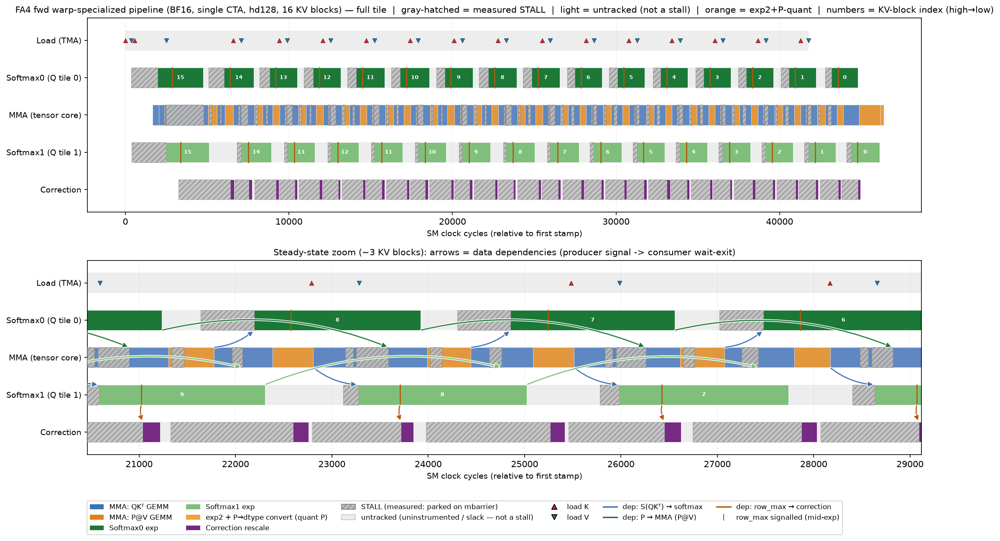

# Warp-Specialization Report Skill

Profile a warp-specialized GPU kernel (CuTe-DSL or CUDA C++) by stamping the
per-SM `clock()` at its synchronization points, then reconstruct a per-warp
**pipeline timeline**. It makes three things visible that ordinary profilers do
not: **stalls**, **cross-warp data dependencies**, and **compute/memory overlap**.

See [`SKILL.md`](SKILL.md) for the method (5 steps + instrumentation patterns).
[`helpers/plot_timeline.py`](helpers/plot_timeline.py) is a kernel-agnostic plotter
driven by a small JSON spec. This README is a complete worked example.

---

## Worked example: FlashAttention-4 forward (Blackwell / SM100, BF16)

A single CTA runs the FA-4 forward warp-specialized pipeline: a TMA **load** warp
streams K/V; one **MMA** warp issues both GEMMs (QKᵀ and P@V) on the tensor core;
two **softmax** warpgroups process two Q tiles (the ping-pong); a **correction**
warp rescales the output accumulator for online softmax. They coordinate through
`mbarrier`/pipeline objects.

### Warp roles and the stamps placed at each sync boundary

| role (prof id) | warps | clock() stamps (event id → meaning) |
|---|---|---|
| Load (0)       | w14   | `0`=K issue, `1`=V issue |
| MMA (1)        | w12   | `0/1`=QKᵀ issue (s0/s1), `2/3`=P@V issue, `8/9`=PV-acquire **enter**, `10/11`=PV-acquire **exit**, `12/13`=V-wait enter/exit, `14/15`=K-wait enter/exit |
| Softmax0 (2)   | w0-3  | `0`=wait begin, `1`=S(=QKᵀ) ready, `2`=P done, `3`=row_max signalled |
| Softmax1 (3)   | w4-7  | (same as Softmax0) |
| Correction (4) | w8-11 | per stage s: `3s+0`=wait, `3s+1`=stats ready, `3s+2`=O rescaled |

The **enter/exit pair around each blocking wait** is what yields the stall bars;
the **producer-signal → consumer-wait-exit** pairs are the dependency arrows.

### Result



Reading it (top = full tile over 16 KV blocks; bottom = steady-state zoom):

- **Overlap (the point of the design):** softmax-exp covers **~97% of the MMA
  active span** — the tensor core and the exp units run essentially fully
  concurrently. Both softmax warpgroups are active → the two-Q-tile ping-pong.
- **Stalls (gray hatch):** MMA **25%** (blocked at `PV-acquire`, i.e. waiting for
  softmax's P; its K/V waits are ~0, so the load warp is *not* the bottleneck),
  Softmax0/1 **21% / 11.5%** (waiting for MMA's QKᵀ), Correction **75%** (mostly
  idle — it only rescales when a row-max grew). MMA stalling 25% on softmax is the
  live signature of the MMA-vs-exp co-bottleneck.
- **Dependency arrows:** blue `S(QKᵀ) → softmax`, green `P → MMA` (the key
  GEMM↔softmax edge — the arrowhead lands exactly where the MMA stall ends),
  orange `row_max → correction`. The orange arrow leaves the **middle** of a
  softmax bar: softmax publishes the row-max *before* finishing the exp, so
  correction can start early — a deliberate pipelining win.

### Reproduce the chart from the trace

The stamp buffer (`prof`, shape `(5, 16, 64)` int32) is in
[`examples/flash_attention_trace.npz`](examples/flash_attention_trace.npz); the
spec mapping slots → spans/arrows is
[`examples/flash_attention_spec.json`](examples/flash_attention_spec.json):

```bash
python helpers/plot_timeline.py \
    --trace examples/flash_attention_trace.npz \
    --spec  examples/flash_attention_spec.json \
    --out   out.png --zoom 0.2
# prints per-warp stall % and the MMA<->softmax overlap ratio
```

This produces [`examples/generic_plotter_output.png`](examples/generic_plotter_output.png)
— the same structure rendered by the generic, kernel-agnostic plotter. (The
headline image above was made by a slightly more detailed kernel-specific variant
that additionally colors the MMA row by QKᵀ vs P@V; the generic spec keeps the MMA
row as a single "active" color for simplicity.)

---

## Files

| file | purpose |
|---|---|
| [`SKILL.md`](SKILL.md) | the method: identify roles → stamp clock() at sync boundaries → single-CTA buffer → plot; instrumentation patterns for CuTe-DSL and CUDA C++ |
| [`helpers/plot_timeline.py`](helpers/plot_timeline.py) | generic, spec-driven Gantt plotter. Renders three per-row states — colored *active work*, gray-hatched *measured stall*, light *untracked* (uninstrumented, **not** a stall) — plus markers/dependency-arrows + stall% and overlap metrics |
| `examples/flash_attention_timeline.png` | headline example figure |
| `examples/flash_attention_trace.npz` | the raw clock() stamp buffer for the example |
| `examples/flash_attention_spec.json` | spec mapping the buffer to rows/spans/arrows |
| `examples/generic_plotter_output.png` | the example rendered by `helpers/plot_timeline.py` |
